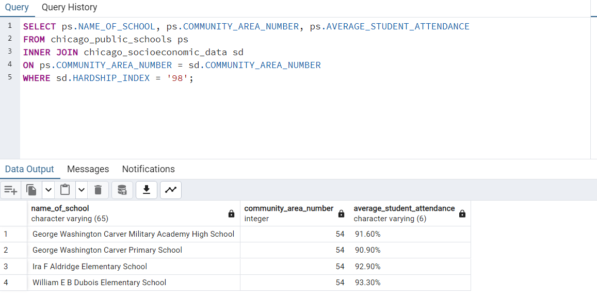
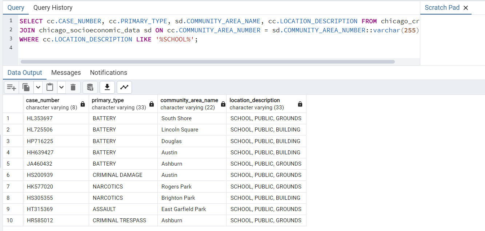

## Exploring SQL Functions & Objects

**Data Source**: We will be using the [CHICAGO_DATA](Images_and_files/CHICAGO_DATA.sql) set for this lab. Run the script to create and populate tables with data.  

### Task 1: **Using Joins**

A JOIN clause is used to combine rows from two or more tables, based on a related column between them. There are various types of joins we can use based on our query requrement:

* **INNER JOIN:** Returns records that have matching values in both tables

* **LEFT JOIN:** Returns all records from the left table, and the matched records from the right table

* **RIGHT JOIN:** Returns all records from the right table, and the matched records from the left table

* **FULL JOIN:** Returns all records when there is a match in either left or right table


#### 1. **Write and execute a SQL query to list the school names, community names and average attendance for communities with a hardship index of 98.**

##### SOLUTION:
For our case, we will use the **inner join**. 

The below code fetches the NAME_OF_SCHOOL, COMMUNITY_AREA_NUMBER and AVERAGE_STUDENT_ATTENDANCE entries from the **chicago_public_schools** table for all the COMMUNITY_AREA_NUMBER values that match the COMMUNITY_AREA_NUMBER values in the chicago_socioeconomic_data. 

The code then filters the output to only those records that have their **HARDSHIP_INDEX** value set to **'98'**.


```
SELECT ps.NAME_OF_SCHOOL, ps.COMMUNITY_AREA_NUMBER, ps.AVERAGE_STUDENT_ATTENDANCE 
FROM chicago_public_schools ps
INNER JOIN chicago_socioeconomic_data sd
ON ps.COMMUNITY_AREA_NUMBER = sd.COMMUNITY_AREA_NUMBER
WHERE sd.HARDSHIP_INDEX = '98'; 

```
Here is the snapshot of the output. 




#### 2. **List all crimes that took place at a school. Include case number, crime type and community name.**

##### SOLUTION:

This problem is quite similar to the problem above but now we will be required to use the '**LIKE**' operator to search for a specified pattern in a column. For this case, we will search for the occurrence of the phrase '**SCHOOL**' from the **LOCATION_DESCRIPTION** column in the **chicago_crime** table. 

There are two wildcards often used in conjunction with the **LIKE** operator:


* **%** The percent sign represents zero, one, or multiple characters

* **_** The underscore sign represents one, single character

We need to search an entire phrase so we will use the **%** sign.

Additionally, we need to join the **chicago_crime** table and the **chicago_socioeconomic_data** table using the **COMMUNITY_AREA_NUMBER** even though the two columns are of different data types. We have a **Varchar** and **Integer** type respectively. 

To overcome this challenge, we will cast the COMMUNITY_AREA_NUMBER in the chicago_socioeconomic_data table from an integer into a varchar(2) using the `:: ` cast operator as shown below:


```
SELECT cc.CASE_NUMBER, cc.PRIMARY_TYPE, sd.COMMUNITY_AREA_NAME, cc.LOCATION_DESCRIPTION 
FROM chicago_crime cc
JOIN chicago_socioeconomic_data sd 
ON cc.COMMUNITY_AREA_NUMBER = sd.COMMUNITY_AREA_NUMBER::varchar(2)
WHERE cc.LOCATION_DESCRIPTION LIKE '%SCHOOL%';
```

The output of the above query is as shown below. 


