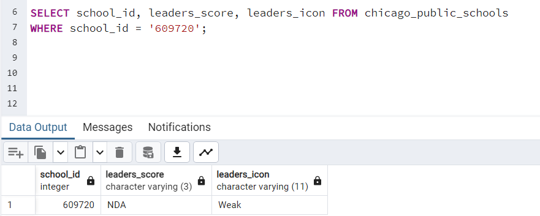
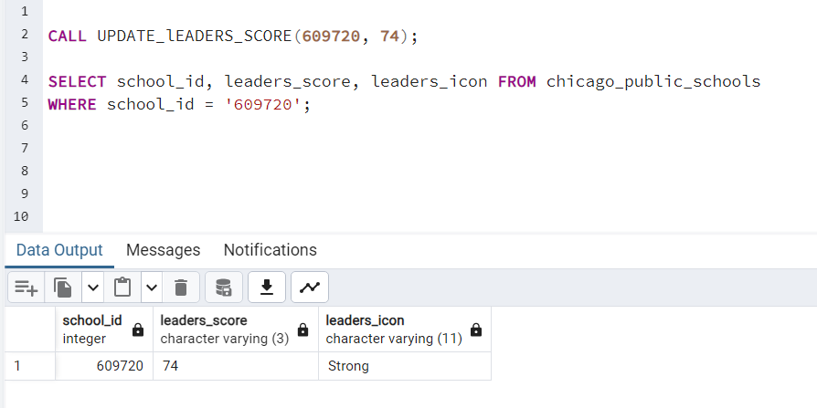

## Exploring SQL Functions & Objects

**Data Source**: We will be using the [CHICAGO_DATA](Images_and_files/CHICAGO_DATA.sql) set for this lab. Run the script to create and populate tables with data.  

### Task 2: **Using Stored Procedures**

Stored procedures in SQL are prepared SQL statements that are created and stored in a database management system and can be reused over and over again. 

They can accept input parameters, perform defined operations and return multiple output values. 

Stored procedures help in **reduced network traffic** and **improved application performance** since they are only compiled **once** yet highly reusable.

Basic syntax:
```
CREATE PROCEDURE procedure_name 
AS 
BEGIN 
sql_statement 
END  
```

##### PROBLEM: 
* Create a stored procedure called **UPDATE_LEADERS_SCORE** that takes a in_School_ID parameter as an integer and a in_Leader_Score parameter as an integer.

* Proceed to write a SQL statement to update the Leaders_Score field in the CHICAGO_PUBLIC_SCHOOLS table for the school identified by in_School_ID to the value in the in_Leader_Score parameter.

* Use an SQL IF-statement to update the Leaders_Icon column in the CHICAGO_PUBLIC_SCHOOLS table for the school identified by in_School_ID based on these conditions:

IF 0 < in_Leaders_Score > 20 SET **Leaders_Icon** as 'Very_weak'

IF in_Leaders_Score < 40 SET **Leaders_Icon** as 'Weak'

IF in_Leaders_Score < 60 SET **Leaders_Icon** as 'Average'

IF in_Leaders_Score < 80 SET **Leaders_Icon** as 'Strong'

IF in_Leaders_Score < 100 SET **Leaders_Icon** as 'Very_strong'


##### SOLUTION:

To update an existing column in a SQL table, you can use the **UPDATE** statement. Here's the basic syntax:

``` UPDATE table_name
SET column_name = new_value
WHERE condition;
```

Here's a breakdown of the syntax: 

**UPDATE:** Specifies the table to update.

**SET:** Assigns new values to the specified columns.

**column_name:** The name of the column you want to update.

**new_value:** The new value to assign to the column.

**WHERE:** Specifies the conditions that must be met for the update to take place.

For instance, in our case, if you want to update the **"leaders_Icon"** column in the **"chicago_public_schools"** table where the **"school_id"** matches a certain value, your SQL statement might look like this:

```
UPDATE chicago_public_schools
SET leaders_Icon = 'Average'
WHERE school_id = in_School_ID;
```

Now, combining all this concepts, our [complete solution](Images_and_files/Stored_procedure_script.sql) to this problem should look like this:

```
-- Naming the procedure
CREATE OR REPLACE PROCEDURE UPDATE_lEADERS_SCORE(IN in_School_ID INTEGER, IN in_Leaders_Score INTEGER) -- Setting parameters and their data type

LANGUAGE plpgsql AS 
$func$

BEGIN
	UPDATE chicago_public_schools
	SET leaders_score = in_Leaders_Score
	WHERE school_id = in_School_ID;

-- IF Statement to update the Leaders_Icon field

IF in_Leaders_Score > 0 AND in_Leaders_Score < 20 THEN
	UPDATE chicago_public_schools
	SET leaders_icon = 'Very_weak'
	WHERE school_id = in_School_ID;
	
	ELSIF in_Leaders_Score < 40 THEN
	UPDATE chicago_public_schools
	SET leaders_Icon = 'Weak'
	WHERE school_id = in_School_ID;
	
		
	ELSIF in_Leaders_Score < 60 THEN
	UPDATE chicago_public_schools
	SET leaders_Icon = 'Average'
	WHERE school_id = in_School_ID;
	
		
	ELSIF in_Leaders_Score < 80 THEN
	UPDATE chicago_public_schools
	SET leaders_Icon = 'Strong'
	WHERE school_id = in_School_ID;
	
		
	ELSIF in_Leaders_Score < 100 THEN
	UPDATE chicago_public_schools
	SET leaders_Icon = 'Very_strong'
	WHERE school_id = in_School_ID;
	
ELSE ROLLBACK;
END IF;
END
$func$;
```

Once you have run the above SQL Statement to create our stored procedure, the next step would be to call our function, specifying a valid **school_id** value and the integer value to update our **leaders_score**.

**NOTE:** Prior to calling our stored procedure, I had to alter the **Leaders_Icon** column to be able to accomodate more Varchar using the following command: 

`ALTER TABLE CHICAGO_PUBLIC_SCHOOLS ALTER COLUMN "Leaders_Icon" SET DATA TYPE VARCHAR(11);`

Now let's update the leaders_score and leaders_icon for the school_id **609720** that was initially set as shown below using our stored procedure:



Calling our stored procedure and passing our parameters as:

`CALL UPDATE_lEADERS_SCORE(609720, 74);`

We have our values successfully updated as outlined in our IF-Statement:

