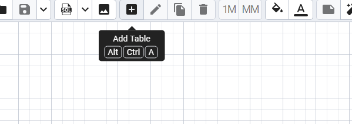
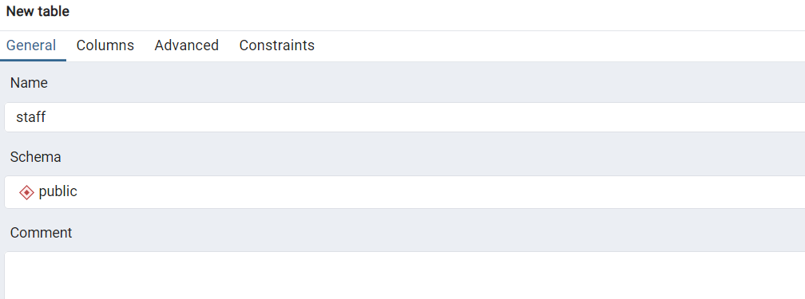
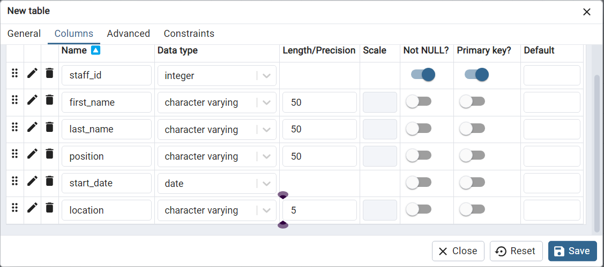
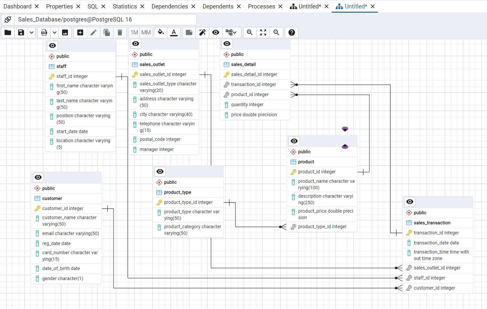
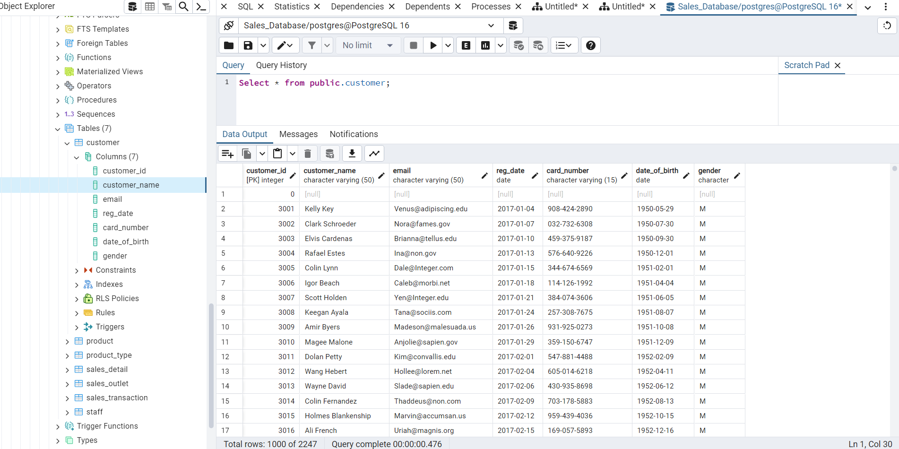

## CREATING AND POPULATING TABLES

We wish to create a database for a retail shop, call it ABZ. We will break down this project into three main tasks:

1. Define entities and their attributes
2. Create an ER diagram highlighting the relationship between tables
3. Write sql script to create and populate the tables with data

### Task 1: Define entities and their attributes

The ABZ retail management has suggested the following database specifications that will help meet their business requirements:

* A tables to access staff members info
* Access to info regarding each sales outlet
* Access to customer info
* Access to sales details
* Info regarding a specific product including its categorization and nature of prodcut
* Sales transaction details 

As the database administrator, we have identified 7 entities: **STAFF, SALES OUTLET, CUSTOMER, SALES DETAIL, PRODUCT, PRODUCT TYPE & SALES TRANSACTION.**
We will create a database table for each and the table below shows more information about these entities. The column header represent the entity while the row entries show their attibutes. The first row is bold to show the table attribute that will act as the primary key. 

|  STAFF  |  SALES OUTLET| CUSTOMER | SALES DETAIL|PRODUCT|PRODUCT TYPE|SALES TRANSACTION|
|--------| -------------|----------|--------------|-------|------------|-----------------|
|**Staff Id**| **Sales Outlet ID**| **Customer ID**| **Sales Detail ID**|**Product ID**|**Product Type ID**|**Transaction ID**|
|First Name| Sales Outlet Type|Customer Name|Transaction ID|Product Name|Product Type|Transaction Date|
|Last Name | Address|Email|Product ID|Description|Product Category|Transaction Time|
| Position |City|Reg Date|Quantity|Product Price||Sales Outlet ID|
| Start Date|Telephone|Card Number|Price|Product Type ID||Staff ID|
| Location |Postal Code|Date of Birth||||Customer ID|
||Manager|Gender|

### Task 2: Create an ER diagram highlighting the relationship between tables

We will be using the Postrgres' pgAdmin graphical user interface (GUI) tool to create the entity relationship diagram.

  1. Open the pgAdmin tool and navigate to the **Object Explorer** pane on the left.

  2. In the tree-view, expand **Servers > postgres > Databases.** Right-click on Databses and got to **Create** > **Database** and name your database as '**Sales_Database**'.

  3. Now Right-click on **Sales_Database** and go to **ERD For Database**. This will open up an empty ERD creation canvas. 

  4. From the **ERD tool bar**, click on **Add Table.** 

        . 

  5. Enter you desired table name and without exiting, switch to the **Columns** tab. For our case, we created a table named '**staff**.'

      .

  6. Add all the columns of the relation **staff** as shown below and click on **Save** to finish creating the table. Do the same for all tables and their attributes as illustrated in the table above. 

  .

Once you've created all the tables, define a one-to-many relationship between various tables based on the shared column. Below are the existing one-to-many relationships for our database:

1. **staff** and **sales_transaction** on the **staff_id** column.

2. **sales_outlet** and **sales_transaction** on the **sales_outlet_id** column.

3. **customer** and **sales_transaction** on the **customer_id** column.

4. **sales_detail** and **sales_transaction** on the **sales_detail_id** column.

5. **product_type** and **product** on the **product_type_id** column.

6. **product** and **sales_detail** on the **product_id** column.

The resulting ER diagram should look like this:

.

### Task 3: Write sql script to create and populate the tables with data.

Now that we have successfully created our ER diagram, we can easily generate an SQL script from the diagram. Running this script will help to create the actual tables in our database and define the existing  relationship between these table.

Here is the generated script file: [Sales_database.sql](Sales_Database.sql).

After running the script above, we can now populate our tables with data. Run the [ABZ_table_data.sql](ABZ_table_data.sql) file which contains multiple insert statements to load data into our tables. 

We have finally, created our database, created database tables and defined the existing relationships and loaded data as visible from the image below. 

.